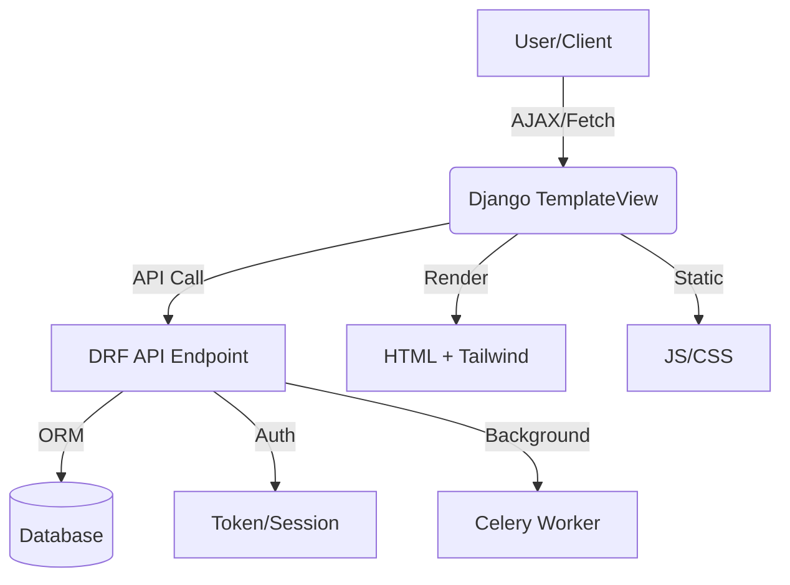

# ERP System

> **A Modern, Modular, API-Driven ERP Platform**

Welcome to your all-in-one, enterprise-grade ERP system! This project is designed for extensibility, beautiful UI, and seamless integration—whether you’re running a business, building a SaaS, or hacking on the next big thing.

---

## ⚡ Requirements
- **Recommended Python version:** Python 3.12.10
- **Django 4.x+**
- **PostgreSQL/MySQL/SQLite** (configurable)

---

## 🛠️ Environment Setup
1. **Copy the example environment file and configure your settings:**
   ```sh
   cp example.env .env
   # Edit .env to set your DB, secret key, etc.
   ```
   - Example DB config in `.env`:
     ```env
     DJANGO_SECRET_KEY=your-secret-key
     DB_ENGINE=django.db.backends.postgresql
     DB_NAME=erp_db
     DB_USER=erp_user
     DB_PASSWORD=yourpassword
     DB_HOST=localhost
     DB_PORT=5432
     ```
2. **Install dependencies and activate your environment**
   ```sh
   python -m venv venv
   source venv/bin/activate  # or venv\Scripts\activate on Windows
   pip install -r requirements.txt
   ```

---

## 🚀 Features
- **Multi-Company, Multi-User**: Manage multiple companies, each with their own users, roles, and data.
- **Role-Based Access Control (RBAC)**: Fine-grained, hierarchical permissions for every module (department, level, parent roles).
- **Multi-level Chart of Accounts (COA)**: Dynamic, 5-level COA with account mapping in all modules.
- **Modular Apps**: CRM, Sales, Purchase, Inventory, Accounting, HR, Project, Manufacturing, and more.
- **RESTful API**: Every business entity is accessible via secure, company-filtered endpoints.
- **Modern Frontend**: Tailwind CSS, AJAX-powered CRUD, and beautiful, responsive templates.
- **Audit Trails & Activity Logs**: Every action is tracked for compliance and transparency.
- **Background Tasks**: Celery integration for heavy-lifting (PDFs, emails, reports).
- **PDF Generation**: Invoices, payslips, and reports at your fingertips.
- **i18n Ready**: Multi-language support for global teams.

---

## 🧾 Chart of Accounts (COA) & Accounting Integration
- **COA Structure**: Supports AccountCategory (top), AccountGroup (mid), Account (leaf), with up to 5-level hierarchy.
- **Account Mapping**: All modules (Sales, Purchase, Inventory, Manufacturing, HR, CRM, Project) linked to COA accounts for full traceability.
- **Validation**: Prevent posting to group/disabled accounts, enforce account type constraints.
- **Auto-Posting Utility**: Use `accounting/utils.py` for programmatic journal posting and validation.

---

## 🛡️ Hierarchical Role & Access Control
- **Role Model**: Supports department, level (1/2/3...), and parent (for hierarchy).
- **API**: Manage roles, users, and companies via `/api/user_auth/roles/`, `/api/user_auth/users/`, etc.
- **Custom Permissions**: Scaffold your own DRF permission classes for department/level-based access control.

---

## 📖 API Documentation

Looking to integrate or automate? Check out the full, beautifully formatted [API Documentation](API_DOCS.md) for all available endpoints, authentication, and usage examples! ✨

---

## 🏗️ Project Structure

```text
ERP System/
├── core/              # Shared utilities (PDF, API JS, Celery, filters)
├── user_auth/         # User, company, role, authentication, activity log
├── crm/               # Customers, leads, opportunities, communication logs
├── sales/             # Products, taxes, quotations, sales orders, invoices, payments
├── purchase/          # Suppliers, purchase orders, bills, payments
├── inventory/         # Product categories, stock, warehouses, movements, alerts
├── accounting/        # Chart of accounts, journals, ledgers, payables, receivables, bank, tax, currency
├── hr/                # Employees, attendance, leave, payroll, payslips, HR reports
├── project_mgmt/      # Projects, tasks, time entries, project reports
├── manufacturing/     # BOM, work orders, production plans
├── templates/         # Global and app-specific templates (Tailwind)
├── static/            # Static files (JS, CSS, images)
├── manage.py
└── README.md
```

---

## 🔗 API Overview

All business data is available via RESTful endpoints, secured by token/session authentication and company filtering.

**Example Endpoints:**
- `/api/crm/customers/` — CRUD for customers (includes account mapping)
- `/api/sales/products/` — CRUD for products
- `/api/purchase/suppliers/` — CRUD for suppliers
- `/api/inventory/stockitems/` — CRUD for stock (includes account mapping)
- `/api/accounting/accounts/` — Chart of accounts (multi-level)
- `/api/hr/employees/` — Employee directory
- `/api/project/projects/` — Project management (includes account mapping)
- `/api/manufacturing/boms/` — Bill of materials (includes account mapping)
- `/api/user_auth/roles/` — Manage hierarchical roles

**Authentication:**
- Obtain a token: `POST /api/token-auth/` with username/email and password
- Use `Authorization: Token <token>` in API requests

👉 **For the full list of endpoints, methods, and usage, see the [API Documentation](API_DOCS.md)!**

---

## ⚙️ Business Logic Utilities
- **Auto-Posting**: Use `accounting.utils.auto_post_journal()` to post to journals programmatically (with validation).
- **Validation**: Use `accounting.utils.validate_account_for_posting()` to ensure only valid accounts are used for posting.

---

## 🖥️ Frontend (Django + Tailwind + API)

- All CRUD operations are performed via AJAX/fetch to the API
- Each module has its own UI page (e.g., `/crm/customers-ui/`, `/sales/products-ui/`)
- Modals for add/edit, instant feedback, and no page reloads

---

## ⚙️ Setup & Usage

1. **Configure your database and settings** (see `.env` and `setting/settings.py`)
2. **Run migrations**
   ```sh
   python manage.py makemigrations
   python manage.py migrate
   ```
3. **Seed the database with demo data**
   ```sh
   python manage.py seed_erp
   ```
4. **Create a superuser**
   ```sh
   python manage.py createsuperuser
   ```
5. **Run the development server**
   ```sh
   python manage.py runserver
   ```
6. **(Optional) Start Celery for background tasks**
   ```sh
   celery -A celery worker --loglevel=info
   ```
7. **Access the app**
   - Admin: `http://localhost:8000/admin/`
   - API: `http://localhost:8000/api/`
   - Frontend: `http://localhost:8000/crm/customers-ui/` (and similar for each module)

---

## 🗺️ High-Level Architecture



---

## 📦 Extending & Customizing
- Add new modules by creating a Django app and following the pattern
- Add new API endpoints with DRF ViewSets/Serializers
- Add new UI pages with TemplateView + Tailwind + JS
- Use Celery for heavy-lifting (PDFs, emails, reports)
- Add your own business logic, workflows, and integrations

---

## 💡 Inspiration & Credits
- Tailwind CSS for beautiful, modern UI
- Django REST Framework for robust APIs
- WeasyPrint for PDF generation
- Celery for background tasks

---

## 📝 License
MIT (or your choice)

---
