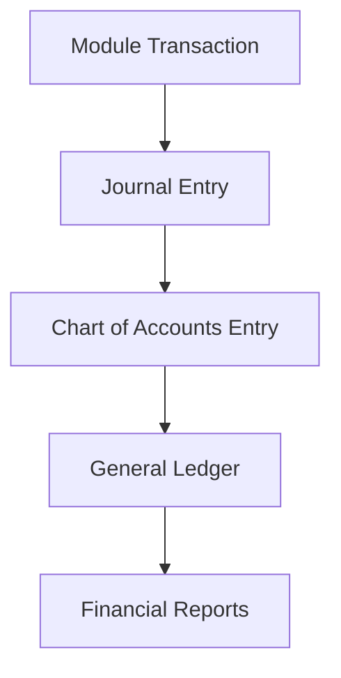

# 🧾 ERP Accounting Flow & Chart of Accounts (COA) Integration

This document explains how the **entire ERP system flows through Accounting**, connecting all major modules like Sales, Purchase, Inventory, Manufacturing, CRM, HR, and Projects to the **Chart of Accounts (COA)**. It ensures that every transaction is recorded, traceable, auditable, and aligned with double-entry bookkeeping.

---

## 🧱 1. Chart of Accounts (COA) Core Structure

| Account Type | Examples                               | Purpose                          |
| ------------ | -------------------------------------- | -------------------------------- |
| Assets       | Bank, Cash, Accounts Receivable, Stock | Track what the business owns     |
| Liabilities  | Loans, Payables, Tax Payable           | Track what the business owes     |
| Equity       | Capital, Retained Earnings             | Owner’s interest in the business |
| Income       | Sales Revenue, Interest Earned         | Earnings from operations         |
| Expenses     | Rent, Utilities, COGS, Payroll         | Costs to operate the business    |

---

## 🔗 2. Module-wise COA Integration

### 🔸 a. **Sales Module**

- **Trigger Points**:
  - Sales Order Confirmation (optional revenue forecast)
  - Delivery / Invoice (confirmed revenue)
- **COA Flow**:
  - Debit: Accounts Receivable
  - Credit: Sales Revenue
  - Debit: COGS (Cost of Goods Sold)
  - Credit: Inventory

### 🔸 b. **Purchase Module**

- **Trigger Points**:
  - Supplier Bill Invoice 
- **COA Flow**:
  - Debit: Inventory / Expense Account
  - Credit: Accounts Payable

### 🔸 c. **Inventory Module**

- **Trigger Points**:
  - Stock In / Stock Out / Adjustments
- **COA Flow**:
  - Stock In: Debit Inventory, Credit GRN Suspense
  - Stock Out (linked to Sales): Debit COGS, Credit Inventory
  - Adjustments: Debit or Credit Inventory Adjustment Account

### 🔸 d. **Manufacturing (MRP)**

- **Trigger Points**:
  - Start of Production, Completion of Production
- **COA Flow**:
  - Raw Material Issue: Credit Raw Material Inventory, Debit WIP
  - Finished Goods Complete: Debit Finished Goods Inventory, Credit WIP

### 🔸 e. **CRM (Leads & Customers)**

- **Trigger Points**:
  - Customer Invoice (through Sales)
  - Supplier Onboarding (linked to Purchase)
- **COA Flow**:
  - CRM doesn’t directly affect COA but connects entities that do.

### 🔸 f. **HR & Payroll**

- **Trigger Points**:
  - Monthly Payroll Processing
- **COA Flow**:
  - Debit: Salary Expense, Tax Expense, Other Allowances
  - Credit: Salary Payable, Tax Payable, Benefits Payable

### 🔸 g. **Projects**

- **Trigger Points**:
  - Project Expense, Project Billing
- **COA Flow**:
  - Billing: Debit Accounts Receivable, Credit Project Revenue
  - Expense: Debit Project Expense, Credit Cash/Payables

### 🔸 h. **Expenses Module**

- **Trigger Points**:
  - Expense submission and approval
- **COA Flow**:
  - Debit: Specific Expense Account (Travel, Meals, etc.)
  - Credit: Petty Cash / Employee Payable / Bank

---

## 🔁 3. General Ledger (GL) Flow

- All modules post journal entries mapped to specific COA.
- Every JE is balanced (Debit = Credit).

---

## 📋 4. Reports Generated from COA

- Balance Sheet
- Profit & Loss Statement
- Trial Balance
- Aged Receivables/Payables
- Inventory Valuation
- Payroll Summary
- Project Profitability

---

## ⚙️ 5. Configuration Best Practices

- Use COA templates per industry
- Tag each product, expense, or invoice line with an account
- Use account groups and sub-accounts for clarity
- Enable audit logging and document attachment for each JE

---

## 🔐 6. Roles & Permissions

| Role            | Access                            |
| --------------- | --------------------------------- |
| Accountant      | Full COA and Journal Access       |
| Module Managers | Limited to their module’s entries |
| Auditors        | Read-only across all modules      |
| Admin           | Configuration and Master Rights   |

---

Let me know if you’d like a visual **PDF export**, or diagrams of **inter-module COA mapping**.

