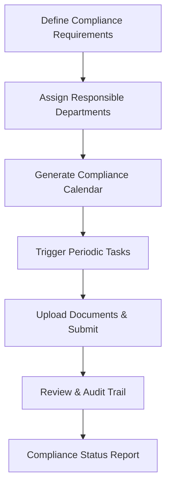

# ✅ Compliance Module – ERP System

This document outlines a **Comprehensive Compliance Module** integrated with the ERP system. It ensures legal, regulatory, and internal policy adherence across all modules like HR, Finance, Inventory, and Manufacturing.

---

## 🧭 1. Objectives

- Monitor and enforce legal and regulatory compliance.
- Automate documentation and audit trails.
- Manage certifications, licenses, tax filings, safety, and labor law compliance.
- Link to every critical module for real-time compliance tracking.

---

## 🧱 2. Core Models

### a. **Compliance Category**

- Category Name (e.g., Tax, Safety, HR, Environmental, Industry-specific)
- Module Linked (Accounting, HR, etc.)

### b. **Compliance Requirement**

- Title, Description
- Type: Mandatory / Optional
- Jurisdiction (Local/Regional/Global)
- Linked Category
- Recurrence: One-time / Monthly / Quarterly / Annually
- Responsible Department/User

### c. **Compliance Event / Task**

- Linked Requirement
- Status: Pending / In-Progress / Submitted / Approved / Overdue
- Deadline, Completion Date
- Attachment (Document proof)
- Auditor Review Fields

### d. **Document Repository**

- File Uploads
- Linked to Requirement or Event
- Expiry Reminder & Alerts
- Secure Access Roles

---

## 🔁 3. Workflow

---

## 🔗 4. Integration Points

| Module        | Compliance Link                                     |
| ------------- | --------------------------------------------------- |
| HR            | Labor laws, employee documentation, contracts       |
| Accounting    | Tax compliance, audit trail, statutory reporting    |
| Inventory     | Safety & environmental standards, material handling |
| Manufacturing | ISO/QMS/Environmental guidelines                    |
| Projects      | Risk & legal checks for external-facing projects    |
| CRM           | GDPR/customer data handling regulations             |

---

## 📊 5. Reporting & Monitoring

- Compliance Dashboard (Upcoming, Missed, Submitted)
- Departmental Compliance Rate
- Auditor Summary
- Expiring Documents Report
- Monthly/Quarterly Regulatory Filing Tracker

---

## 🔐 6. Roles & Permissions

| Role               | Access Rights                          |
| ------------------ | -------------------------------------- |
| Compliance Officer | Full access, can add/edit requirements |
| Department Head    | View/Submit relevant tasks             |
| Auditor            | View all data, flag errors             |
| Admin              | Manage configurations & escalations    |

---

## ⚙️ 7. Configurations

- Compliance Categories (Custom)
- Reminder Days (pre-deadline)
- Auto-escalation Rules
- Jurisdiction-based filtering
- Recurrence Policies
- Document Retention Policies

---

## 🌟 8. Optional Features

- External Auditor Portal
- Digital Signatures on submissions
- Blockchain-based audit logging
- Geo-location tagging for physical inspections
- AI-based compliance risk scoring

---

Let me know if you'd like this exported as **PDF**, merged with the HR or Accounting module, or shown in a flowchart form.

