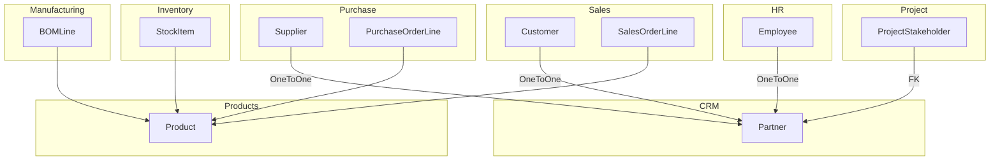

# 📦 ERP Architecture: Centralized `Product` and `Partner` Models

This document explains the **architectural reasoning** and **implementation strategy** behind using:

1. A **separate `Product` app**
2. A **centralized `Partner` model in CRM**

These patterns support scalability, reusability, and modularity across the ERP system.

---

## ✅ 1. Why Use a Separate `Product` App?

### 🔍 Problem:
If we define the `Product` model separately in each app (Sales, Purchase, Manufacturing, Inventory), we risk:
- **Duplication** of data and logic
- **Inconsistency** in product details across modules
- **Difficulty in managing stock and costing**

---

### 💡 Solution:
Create a **dedicated `products` app** that centralizes the `Product` model and all related product data.

```plaintext
products/
├── models.py  ← product definitions
├── views.py
├── admin.py
├── ...
```

---

### 🧱 Sample `Product` Model

```python
# products/models.py
class Product(models.Model):
    name = models.CharField(max_length=255)
    sku = models.CharField(max_length=100, unique=True)
    description = models.TextField(blank=True)
    category = models.CharField(max_length=100)
    type = models.CharField(max_length=50, choices=[('product', 'Product'), ('service', 'Service'), ('raw', 'Raw Material')])
    unit_of_measure = models.CharField(max_length=50)
    is_active = models.BooleanField(default=True)
    is_saleable = models.BooleanField(default=True)
    is_purchasable = models.BooleanField(default=True)
    is_manufacturable = models.BooleanField(default=False)
```

---

### 🔁 Referencing the `Product` Model in Other Apps

- **Sales** → Link products in quotations or order lines
- **Purchase** → Link purchased items to `Product`
- **Manufacturing** → Use in Bills of Materials (BOMs)
- **Inventory** → Track stock of each product

```python
# sales/models.py
product = models.ForeignKey('products.Product', on_delete=models.CASCADE)
```

---

### ✅ Benefits of a Centralized `Product` App

| Benefit | Description |
|--------|-------------|
| 🔁 Reuse | Shared product info across all modules |
| ✅ Clean Logic | Maintain all product-related logic in one place |
| 🔄 Consistency | Single source of truth for product data |
| 📈 Scalable | Easily extendable for pricing, variants, etc. |

---

## ✅ 2. Why Use a Central `Partner` Model in CRM?

### 🔍 Problem:
Defining separate `Customer`, `Supplier`, `Employee`, and `Stakeholder` models leads to:
- Data duplication (name, email, phone repeated everywhere)
- Difficulty handling entities that serve **multiple roles** (e.g., supplier + customer)
- Unnecessary complexity in data integration

---

### 💡 Solution:
Create a **single `Partner` model** in the CRM app to act as a **unified contact record**.

---

### 🧱 Sample `Partner` Model

```python
# crm/models.py
class Partner(models.Model):
    name = models.CharField(max_length=255)
    email = models.EmailField(blank=True)
    phone = models.CharField(max_length=20, blank=True)
    address = models.TextField(blank=True)

    is_customer = models.BooleanField(default=False)
    is_supplier = models.BooleanField(default=False)
    is_employee = models.BooleanField(default=False)
    is_project_stakeholder = models.BooleanField(default=False)

    company_name = models.CharField(max_length=255, blank=True)
    tax_id = models.CharField(max_length=50, blank=True)
```

---

### 🔁 How Other Modules Use It

Each module extends or links to `Partner` for app-specific needs:

#### HR → Employee
```python
class Employee(models.Model):
    partner = models.OneToOneField('crm.Partner', on_delete=models.CASCADE)
    employee_id = models.CharField(max_length=30)
    salary = models.DecimalField(...)
```

#### Purchase → Supplier
```python
class Supplier(models.Model):
    partner = models.OneToOneField('crm.Partner', on_delete=models.CASCADE)
    supplier_code = models.CharField(max_length=50)
    payment_terms = models.CharField(...)
```

#### Sales → Customer
```python
class Customer(models.Model):
    partner = models.OneToOneField('crm.Partner', on_delete=models.CASCADE)
    customer_group = models.CharField(max_length=50)
    loyalty_points = models.IntegerField(default=0)
```

#### Project Management → Stakeholders
```python
class ProjectStakeholder(models.Model):
    partner = models.ForeignKey('crm.Partner', on_delete=models.CASCADE)
    project = models.ForeignKey('Project', on_delete=models.CASCADE)
    role = models.CharField(max_length=100)
```

---

### ✅ Benefits of Central `Partner` Model

| Benefit | Description |
|--------|-------------|
| 🔁 Reuse | Share same entity across apps |
| ✅ Clean Data | Avoids duplication of identity fields |
| 🔗 Relational Consistency | One `Partner` used in multiple places |
| 📆 Scalable | Add roles like `is_contractor`, `is_driver`, etc. |
| 💼 Real-World Modeling | One person can be both customer and supplier |

---

## 🎯 Summary

| Feature | Centralized App | Why? |
|--------|------------------|------|
| `Product` | `products` | Single definition reused across all transactional apps |
| `Partner` | `crm` | Shared contact/organization info reused across HR, Sales, Purchase, Projects, etc. |

By centralizing these two key entities, your ERP becomes:
- Easier to maintain
- Easier to scale
- Cleaner to understand
- Aligned with real-world business logic

---

## 🖊️ Mermaid Diagram



