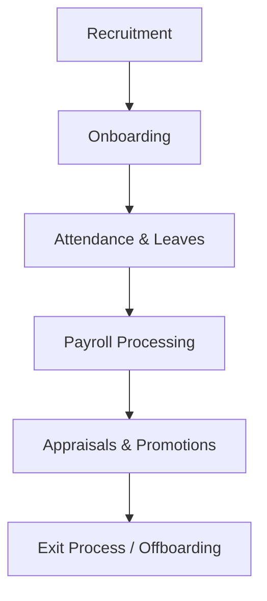

# 👥 Human Resource (HR) Module – ERP System

This documentation defines a comprehensive **HR Module** for a modular ERP system, covering recruitment, employee management, attendance, payroll, leaves, appraisals, and integration with Accounting and Projects.

---

## ✅ 1. Overview

The HR module manages the entire employee lifecycle from recruitment to retirement, supports payroll processing, attendance tracking, leave policies, and ensures regulatory compliance.

---

## 🧩 2. Core Features

---

## 🧾 3. Key Models and Fields

### a. **Employee**

- Name, Employee ID, Department, Designation
- Join Date, Status (Active, Resigned)
- National ID, Contact, Address
- Reporting Manager
- Employment Type (Full-time, Contract, Intern)
- Salary Structure Link
- Documents (CV, Certificates, Contract)

### b. **Department & Designation**

- Org structure
- Department head, sub-departments
- Reporting hierarchies

### c. **Recruitment**

- Job Opening
- Applicant Tracking
- Interview Rounds
- Selection, Offer Letter, Status

### d. **Onboarding**

- Checklist (document submission, orientation)
- Assignment to manager/team
- IT/Asset allocation

### e. **Attendance**

- Daily punch-in/out
- Biometric or manual entry
- Geolocation tracking (optional)
- Shift scheduling

### f. **Leave Management**

- Leave types (Paid, Sick, Unpaid)
- Entitlement per year
- Leave request & approval flow
- Leave carry-forward, encashment

### g. **Payroll**

- Salary Structure Template
- Basic, Allowances, Deductions
- Overtime, Bonus
- Payroll Periods (monthly/weekly)
- Auto-journal entries
- Bank transfer list

### h. **Loan & Advance**

- Loan amount, repayment schedule
- Auto deduction from payroll

### i. **Appraisals**

- Self & Manager review
- Scoring criteria (KPIs)
- Promotion or increment decision

### j. **Training & Development**

- Courses, Enrollments
- Training needs per role
- Completion status

### k. **Exit / Offboarding**

- Resignation submission
- Asset return
- Final settlement
- Exit interview

---

## 🧮 4. Accounting Integration

| Action                 | Debit          | Credit      |
| ---------------------- | -------------- | ----------- |
| Monthly Salary Expense | Salary Expense | Bank / Cash |
| Loan Deduction         | Loan Account   | Bank / Cash |
| Bonus / OT             | Salary Expense | Bank / Cash |

---

## 📈 5. Reports

- Employee Directory
- Monthly Attendance Sheet
- Payroll Register
- Salary Slip
- Leave Balance Report
- Attrition Report
- Recruitment Funnel
- Training Report
- Appraisal History

---

## 🔧 6. Configuration Options

- Salary structures by designation
- Shift rules & grace period
- Leave policies (by location or level)
- Tax slab definitions
- Bonus cycles (year-end, quarterly)
- Approval chains (multi-level)
- Employment contracts

---

## 🔐 7. Roles & Permissions

| Role            | Access To                           |
| --------------- | ----------------------------------- |
| HR Manager      | Full module                         |
| Recruiter       | Recruitment, onboarding             |
| Payroll Officer | Payroll processing & salary slips   |
| Manager         | Team attendance, leaves, appraisals |
| Employee        | Self-service (leave, attendance)    |

---

## 🔄 8. Integration with Other Modules

| Module        | Integration Point                      |
| ------------- | -------------------------------------- |
| Accounting    | Payroll, salary expense entries        |
| Projects      | Assign employees to tasks, timesheets  |
| CRM           | Assign salesperson or customer manager |
| Manufacturing | Labor costing in production logs       |
| Assets        | Asset allocation to employees          |

---

## 🌟 9. Optional Features

- ESS Portal (Employee Self-Service)
- Mobile punch-in (with location/photo)
- Attendance via QR/biometric device
- Tax form generation (e.g., Form-16, WHT)
- Auto appraisal reminders
- Integration with job portals (LinkedIn, etc)
- HR Letters (offer, increment, etc)

---

Let me know if you'd like this exported as **Markdown**, **PDF**, or **Mermaid-ready GitHub documentation**.

