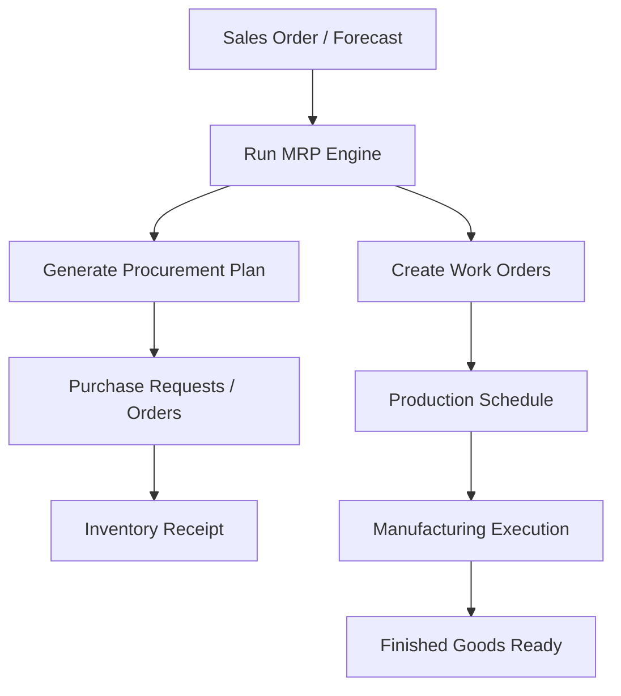

# ⚙️ MRP (Material Requirements Planning) Module – ERP System

This document outlines a complete **MRP Module** for an ERP system. It enables accurate material planning, optimized stock levels, and production alignment based on demand forecasts or actual sales orders.

---

## ✅ 1. Overview

MRP automates planning for raw materials and production resources based on:

- Sales Orders
- Forecasts
- Minimum Stock Rules
- Bill of Materials (BoM)

The goal is to ensure materials and products are available at the right time and in the right quantities without overstocking.

---

## 📦 2. Inputs to MRP

| Input                | Description                                |
| -------------------- | ------------------------------------------ |
| Sales Orders         | Actual demand input for finished goods     |
| Forecasts            | Expected sales demand over time            |
| BoMs                 | Structure of how products are manufactured |
| Inventory Levels     | Current stock of raw materials & FG        |
| Purchase Lead Times  | Supplier delivery timelines                |
| Work Center Capacity | Manufacturing constraints                  |
| Min/Max Stock Levels | Inventory rules per item                   |

---

## 🛠️ 3. Core MRP Workflow

---

## 🧱 4. MRP Models & Tables

### a. MRP Run Log

- Run Timestamp
- Trigger Source (manual, auto)
- Scope (all products, filtered)
- Status (Pending, Completed, Failed)

### b. MRP Planned Orders

- Type: Purchase / Manufacturing
- Product
- Quantity
- Required Date
- Source Document (SO, Forecast)
- Status (Draft, Confirmed)

### c. Supply-Demand Report

- Product
- Current Stock
- Incoming Qty
- Outgoing Qty
- Net Required Qty

### d. Lead Time Matrix

- Product ID
- Supplier
- Average Lead Time (Days)

---

## 🔁 5. Reordering Logic

- Reorder Point Method (min-max)
- Just-in-time based on actual demand
- Safety Stock buffers
- Auto-create Purchase Request / Work Order when below reorder point

---

## 🧮 6. Integration Points

| Module        | MRP Integration                          |
| ------------- | ---------------------------------------- |
| Sales         | SOs trigger demand                       |
| Inventory     | Uses stock level, adjusts after planning |
| Purchase      | Triggers PR/PO for shortages             |
| Manufacturing | Creates Work Orders                      |
| Accounting    | Cost impact of planned vs actual         |
| BOM/Products  | Defines material needs                   |

---

## 📈 7. Reports & Dashboards

- Net Requirement Report
- Shortage Alerts
- Planning Schedule (Gantt)
- Capacity vs Demand
- Reorder Plan
- MRP Logs

---

## ⚙️ 8. Configuration Options

- MRP Frequency (Daily, Weekly, On Demand)
- Backorder logic
- Lead Time Overrides
- Product Exceptions (non-MRP items)
- Notification rules

---

## 🔐 9. Roles & Permissions

| Role               | Access Rights                     |
| ------------------ | --------------------------------- |
| Planner            | Full access to MRP runs, planning |
| Purchase Officer   | View purchase suggestions only    |
| Production Manager | View/Create work orders           |
| Auditor            | Read-only MRP history             |

---

## 🌟 10. Optional Features

- Forecast-based MRP
- Multi-level BoM explosion
- Pegging & Allocation per order
- Integration with AI-based forecasting engine
- Email alerts for shortage or delay
- Simulation/what-if MRP scenarios
- Versioned BoM handling in MRP

---

Let me know if you'd like this exported as **PDF**, included in a **flowchart**, or bundled with the manufacturing module.

